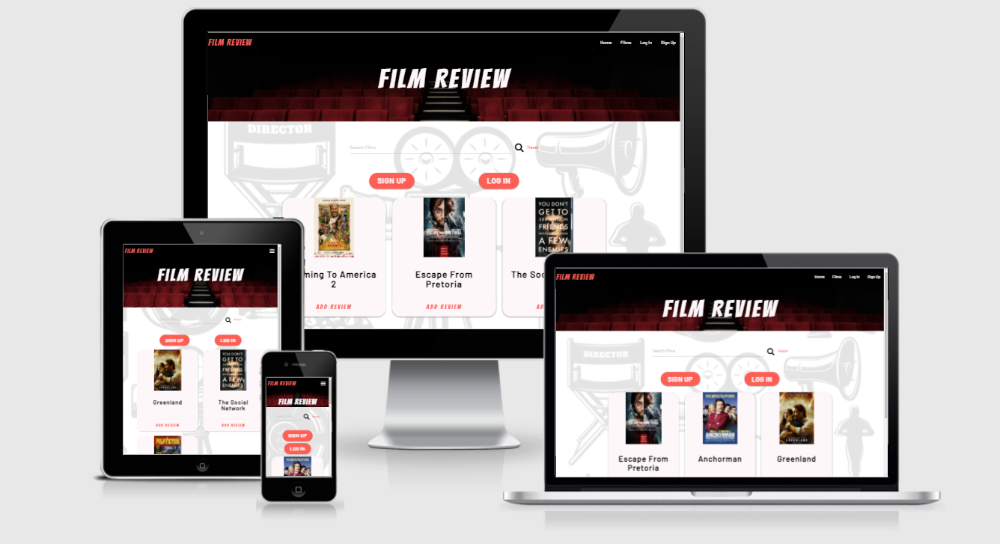

<h1 align="center">Film Review Project</h1>

[View Live Project Here](https://film-review-project.herokuapp.com/index)

Welcome to my film review project built for the Code Institute Data Centric Development module. The scope of the module was to "Build a MongoDB-backed Flask project for a web application that allows users to store and manipulate data records about a particular domain.".
As a film lover I wanted to create a film review website which is controlled by the users of the site, adding films they want in the database aswell as their own reviews. The goal is to eventually build a community of film fans.

## User Experience (UX)
- ### User Stories 
    * #### First Time Users
        1. As a first time user, I want to understand the purpose of the website.
        2. As a first time user, I want to easily navigate around the site.
        3. As a first time user, I want easily find the film I am looking for.
        4. As a first time user, I want to easily create my own account.
        5. As a first time user, I want to find a film to watch quickly.

    * #### Returning/Frequent Users (Film Fans)
        1. As a frequent user, I want to quickly sign into my own account.
        2. As a frequent user, I want to be able to add/edit my own review on a film of my choice.
        3. As a frequent user, I want to be able to add a film, if I can not find it.
        4. As a frequent user, I want to be able to edit or delete a film I have added if required.
        5. As a frequent user, I want to be able to view and edit my info to keep it up to date.

- ### Site Owner Goals
    1. Create a community of film fans.
    2. Create revenue from afilliate links to buy/stream films.

- ## Project Scope Plane
    While in the planning stage of the project I used the user stories and site owners goals to come up with a scope plane and features to include within the project.
    After coming up up with a list of features I created a feature importance and viability table which is below.

    | Feature                          | Importance | Viability |
    |----------------------------------|------------|-----------|
    | Register User                    |     5      |         5 |
    | User Login                       |     5      |         5 |
    | Add/Edit Film                    |     5      |         5 |
    | Add/Edit Review                  |     5      |         5 |
    | Profile page                     |     3      |         4 |
    | Star Rating                      |     2      |         3 |
    |----------------------------------|------------|-----------|
    | Total                            |     25     |        27 |

- ### Design
    * ### Typography
        The two fonts used on the project are *Bangers* for the page titles, and *Barlow* which is used for the main font throughout the project.
    * ### Color Scheme
        The colour scheme for the project is #fdf7fa(Snow) for the main page title and the background colour for the cards, #FE5F55(Orange Red Crayola) for the buttons and titles.
    * ### Imaging
        The main two images on the site are the background images for the header and body. These images were chosen because I felt they complimented eachother well, and portrayed to the user what the site is for.
        The header image was created by Felix Mooneeram and was found on unsplash.com [here](https://unsplash.com/@felixmooneeram?utm_source=unsplash&amp;utm_medium=referral&amp;utm_content=creditCopyText).
        The body image is a vector image created by macrovector and was found on freepik.com [here](https://www.freepik.com/vectors/camera).
    * ### Adding Film Cover Image
        For this project the film cover image is to be added by a URL (as a proof of concept) provided by the site user. I would like to add an upload image feature in the future.
    * ### CRUD Features
        Create, Read, Upload, Delete features are all available but I have chosen to only make them available to users with accounts, furthermore only the user that uploads the film/review can edit or delete the film/review.
    * ### Cards
        Materialize cards are used throughout the project to make sure the website content stands out from the background image.
    * ### Buttons
        All buttons and cards that are clickable are using the class hoverable from materialize to show to the user that they are clickable.
    * ### CTA Login/Sign up buttons
        The Sign up and login buttons on index.html will not show if the user is already logged in.
    * ### Edit film Button
        The edit film button on movie.html will only show on the page when the user that added the film is logged in.

- ### Database
    [MongoDB](https://www.mongodb.com/) was used for the database. The database consists of three collections. The 3 collections are:
        1. Users        
        2. Films
        3. Reviews
    * Users has 4 keys:
        1. _id. (Added automatically across all 3 collections by MongoDB)
        2. Username
        3. Email
        4. Password
    * Films has 7 keys:
        1. _id
        2. Film_img
        3. Film_title
        4. Genre
        5. Desc (Description)
        6. Release_date
        7. Created_by
    * Reviews has 5 keys:
        1. _id
        2. Film_id
        3. Film_title
        4. Review
        5. Created_by
- ### Database Schema Design
    

## Wireframes

Wireframes for the project can be found [here](static/readme_items/wireframes/film_review_wireframes.pdf)

## Features

* Responsive Design, Available on a range of devices.
    [Materialize](https://materializecss.com/) was used to help with the responsiveness of the site.
* Interactive Elements.
* Register Account.
* Login to users profile.
* Random film button to choose a film from the db for the user to watch next.
* CRUD on users profile, (Reviews can only be edited/deleted by the user that added it).
* CRUD on films added by user, (Films can only be edited/deleted by the user that added it).
* CRUD on user added reviews, (Reviews can only be edited/deleted by the user that added it).

## Planned Features

* Adding an upload image file feature to add film.
* Adding a forum page for users to discuss films directly.
* Eventually Add a star rating system.

## Technologies Used

- ### Languages Used
    * [HTML5](https://en.wikipedia.org/wiki/HTML5)
    * [CSS](https://en.wikipedia.org/wiki/Cascading_Style_Sheets)
    * [JavaScript](https://en.wikipedia.org/wiki/JavaScript)
    * [Python](https://en.wikipedia.org/wiki/Python_(programming_language))

- ### Frameworks, Libaries & Programs Used
    1. [MongoDB](https://www.mongodb.com/)
        * MongoDB has been used for the non-relational database.
    2. [Flask](https://flask.palletsprojects.com/en/1.1.x/)
        * Flask was used to build the website.
    3. [jQuery](https://jquery.com/)
        * jQuery was used to initilaize the javascript components from Materialize.
    3. [Google Fonts:](https://fonts.google.com/)
        * Google Fonts was used to import the fonts *Bangers* and *Barlow* into the CSS file and both were used across the website.
    4. [Font Awesome:](https://fontawesome.com/)
        * Font Awesome was used on all pages throughout the website to add icons for aesthetic and UX purposes.
    5. [Git:](https://git-scm.com/)
        * Git was used for version control by utilizing the Gitpod terminal to commit to Git and Push to GitHub.
    6. [GitHub:](https://github.com/)
        * GitHub was used to store the projects code after being pushed from Git.
    7. [Heruko](https://heroku.com)
        * The final project has been deployed using the Heruko platform. 
    7. [Balsamiq:](https://balsamiq.com/)
        * Balsamiq was used to create the [wireframes]() during the design process.
    8. [Favicon.io](https://favicon.io/favicon-converter/)
        * Favicon.io was used to convert the site logo to a favicon for the website. The links for the favicon were also copied from favicon.io.
    9. [Unsplash.com](https://unsplash.com/)
        * Image for the header background has been pulled from Unsplash.
    10. [Freepik.com](https://www.freepik.com/)
        * The vector image for the body background has been pulled from Freepik.
    11. [AmIResponsive.is](http://ami.responsivedesign.is/)
        * The Am I responsive website was used to capture the snapshot of the project. 

## Testing

- ### Testing User Stories

* #### First Time Users
    1. As a first time user, I want to understand the purpose of the website.
        * I am immediately met with a clear to understand design and the title of the website, and three random films with add review button on them. 
        * The images used on the project also help the user understand what the websites purpose is.
    2. As a first time user, I want to easily navigate around the site.
        * I am immediately met with easy to understand buttons and links to move around the website with ease.
    3. As a first time user, I want easily find the film I am looking for.
        * On the home page there is a search bar, where I can search for a film by either the title or the films genre.
    4. As a first time user, I want to easily create my own account.
        * I am met with a Sign Up button at the top of the home page, aswell as a link in the nav bar to register an account.
        * The resgister account page is a simple form, with easy to understand labels for each input.
    5. As a first time user, I want to find a film to watch quickly.
        * I can search for a film using the search bar on the home page or films page by searching a films title or genre
        * When I click the all films button I go through to the films page list, which lists all the films within the database. 
        At the top of this page is a "Let us choose your next watch" button this button will pul a random film from the DB for me to watch next.
        

    * #### Returning/Frequent Users (Film Fans)
        1. As a frequent user, I want to quickly sign into my own account.
            * I am immediately met with a login button at the top of the homepage. Which is also available in the navbar.
            * Once on the login page it is a quick and easy to uderstand process of entering my username and password.
        2. As a frequent user, I want to be able to add/edit my own review on a film of my choice.
            * Each film has a films card, at the bottom of the film card is n add review button.
            * Alternatively when on the individual movie page the review button is within the review section.
        3. As a frequent user, I want to be able to add a film, if I can not find it.
            * There is an add film button on the homepage of the website and within the navbar, once there adding a new film is a simple and easy to understand form.
            * If searching for a film using the search bar and no film with the name or genre exists in the db. 
            Then a message asking me if I would like to add the film along with add film button will show up.
        4. As a frequent user, I want to be able to edit or delete a film I have added if required.
            * If I uploaded the review or the film then a edit button will show up on both the film and the review.
            * If I uploaded the review or the film then a delete button will show up on both the film and the review.
        5. As a frequent user, I want to be able to view and edit my info to keep it up to date.
            * Each user has their own profile page where they can updated their email and password, currently Usernames can not be changed due to security.

- ### Site owner goals testing
    1. Create revenue from afilliate links to buy/stream films.
        * The Watch now curerntly takes the user to a fake tag, This is for demonstration purposes only and would be updated to an official Amazon affiliate link in the future.

- ### Further Testing
- #### Nav-bar Testing
    - When a user is not legged in
        * Testing the Film Review logo, When clicking on the film review logo it should take the user to the home page.
        The expected outcome was acheived.
        * Testing the Home link, When clicking on the Home it should take the user to the home page.
        The expected outcome was acheived.
        * Testing the Films link, When clicking on the Films link it should take the user to the films page.
        The expected outcome was acheived.
        * Testing the Login link, When clicking on the Login link it should take the user to the login page.
        The expected outcome was acheived.
        * Testing the Signup link, When clicking on the Signup link it should take the user to the register page.
        The expected outcome was acheived.
    - When a user is logged in
        * Testing the Home link, When clicking on the Home it should take the user to the home page.
        The expected outcome was acheived.
        * Testing the Films link, When clicking on the Films link it should take the user to the films page.
        The expected outcome was acheived.
        * Testing the Profile link, When clicking on the Profile link it should take the user to the users profile page.
        The expected outcome was acheived.
        * Testing the Add Film link, When clicking on the Add Film link it should take the user to the Add Film page.
        The expected outcome was acheived.
        * Testing the Logout link, When clicking on the Logout link it should log the user out and then take the user to the login page.
        The expected outcome was acheived.

- #### Search bar Testing
    * When enter a unknown search term the films page should display a message telling the user no film was found would they like to add it in.
    The expected outcome is acheived.
    * When entering the name of a film or genre, the films page should find all films relating to the search and display them to the user.
    The expected is acheived

- #### Home Page Testing
    * Testing the resgister button, When clicking on the register button its expected outcome is to take the user to the register page to register account.
    The expected outcome is acheived.
    * Testing the login button, When clicking on the login button its expected outcome is to take the user to the login page to login.
    The expected outcome is acheived.
    * Testing the film cards, when clicking the film image the expected outcome is to take the user to that specific movie page for read reviews and find out more information on the film.
    The expected outcome is acheived.
    * Testing the Add Review button in the film card, when clicking the add review button it should do one of two things 
        - If a user is logged in take the user to add review page for that specific film. 
        The expected outcome for this is achevied.
        - If a user is not logged in then take the user to the login page to login.
        The expected outcome is acheieved.
    * Testing the All Films button, when clicking the all films button the expected outcome is to take the user to the films page where it lists the films in the database.
    The expected outcome is achevied.
    * Testing the Add Film button, when clicking the add film button it should do one of two things 
        - If a user is logged in take the user to add film page to add a film.
        The expected out for this is achevied.
        - If a user is not logged in then take the user to the login page to login.
        The expected outcome is acheieved.

- #### Films page Testing
    * Testing the "lets us pick your next watch" button, When pressing this button the expected outcome is for the films page to display one randomly selected film form the db.
    The expected outcome is acheieved.
    * Testing the film cards, when clicking the film image the expected outcome is to take the user to that specific movie page for read reviews and find out more information on the film.
    The expected outcome is acheived.
    * Testing the Add Review button in the film card, when clicking the add review button it should do one of two things 
        - If a user is logged in take the user to add review page for that specific film. 
        The expected outcome for this is achevied.
        - If a user is not logged in then take the user to the login page to login.
        The expected outcome is acheieved.
    * Testing the pagination buttons.
        - When clicking the previous page button the expected outcome is for the films page to display the previous set of 9 films on the page.
        The expected outcome for this is acheived.
        - When clicking the next page button the expected outcome is for the films page to display the next set of 9 films on the page.
        The expected outcome for this is acheived.

    

- #### Edit Profile Testing
    * Testing editing the username. I chanegd the user name only on the profile page and I clicked the update profile button. 
    This worked as expected but this was when I realised that using the profile page to change the user username means they could duplicate a username that already exists in the database. 
    
- ### Device/Browser Testing
    + Chrome
    + Firefox
    + Microsoft Edge
    + Iphone 6/7/8 plus (Chrome Dev tools)
    + Iphone X (Chrome Dev Tools)
    + Ipad Pro (Chrome Dev tools)
    + Samsung Note 20 Ultra 5G
    + Samsung Galaxy Tab S6 Lite

    My partner also tested the full site using Safari on her Macbook pro., and her Iphone.

## Bugs
- ### Bugs Fixed

    #### Created_by missing bug
    While testing editing a film I discovered when trying to redirect to the movie page, the newly edited film dictionary had no created_by entry, 
    This was human error and was fixed by adding the created_by entry to the edit_film function in app.py.

    #### Duplicate Username bug
    While testing editing the user profile, I realised that changing the users username this way means they can duplicate a username that already exists in the database. 
    I have fixed this by removing the option to edit the users username, I chose to fix the bug this way due to time constraints.

- ### Known Bugs
    #### Flashed messages
    While testing the add film and review buttons, I discovered that the flash message to tell the user they need to login to add film or add review, does not show up. 
    Due to time restraints I was unable to fix this bug at build stage

## Deployment
    
- ### Remote Deployment
    * Go to your Github repository and open it using GitPod
    * Create the requirements.txt file with the dependencies for Heroku in by runnig the command "pip3 freeze --local > requirements.txt" in the gitpod terminal
    * Create the procfile for Heroku by running the command "echo web: python app.py > Procfile" in the gitpod terrminal
    * Check the Procfile, and remove any previous blank lines above web: python app.py
    * Commit and push the requirements.txt and Procfile to Github
    * Log in to Heroku and select Create New App
    * Using the App name input field give the project a name that has not been used before
    * Select the region most suitable to your location
    * Click Create App
    * Next connect the app to the Github repository by clicking on the Deployment Method section and then clicking the Github icon
    * Add your Github profile into the section called connect to Github.
    * Add you repository into the connect to Github section where your profile is displayed
    * Click on the Search button, when it finds the correct repository click the Connect button
    * Click on the settings tab at the top of the page, and select Reveal Config Var
    * Add the variables for IP, PORT, SECRET_KEY, MONGO_URI and MONGODB_NAME 
    * Then select Enable Automatic Deployment to make sure the website is always up to date with the Github repository
    * Select the master branch under Branch Selected
    * Click on the Deploy Branch and wait for the app to build
    * Once the app has built, click View to launch the app
    
- ### Forking the GitHub Repository
    - Fork the project using the following steps
        * Log in to GitHub and locate the [GitHub Repository](https://github.com/DevSteg/film_review_project)
        * At the top of the Repository (not top of page) just above the "Settings" Button on the menu, locate the "Fork" Button.
        * You should now have a copy of the original repository in your GitHub account.

## Credits
    https://flask.palletsprojects.com/en/1.1.x/patterns/viewdecorators/

    https://stackoverflow.com/questions/2824157/random-record-from-mongodb

    Photo by <a href="https://unsplash.com/@felixmooneeram?utm_source=unsplash&amp;utm_medium=referral&amp;utm_content=creditCopyText">Felix Mooneeram</a> on <a href="https://unsplash.com/s/photos/movie?utm_source=unsplash&amp;utm_medium=referral&amp;utm_content=creditCopyText">Unsplash</a>

    <a href='https://www.freepik.com/vectors/camera'>Camera vector created by macrovector - www.freepik.com</a>

    https://www.youtube.com/watch?v=Lnt6JqtzM7I pretty printed

## Ackowledgments

* My Mentor for helpful feedback throughout the project and working calls around my current work schedule.
* My partner for helping me test the project on her devices.