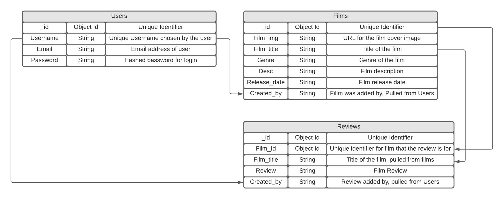

<h1 align="center">Film Review Project</h1>

[View Live Project Here]()

Welcome to my film review project built for the Code Institute Data Centric Development module. The scope of the module was to "Build a MongoDB-backed Flask project for a web application that allows users to store and manipulate data records about a particular domain.".
As a film lover I wanted to create a film review website which is controlled by the users of the site, adding films they want in the database aswell as their own reviews. The goal is to eventually build a community of film fans.

## User Experience (UX)
- ### User Stories 
    * #### First Time Users
        1. As a first time user, I want to understand the purpose of the website.
        2. As a first time user, I want to easily navigate around the site.
        3. As a first time user, I want easily find the film I am looking for.
        4. As a first time user, I want to easily create my own account.
        5. As a first time user, I want to find a film to watch quickly.

    * #### Returning/Frequent Users (Film Fans)
        1. As a frequent user, I want to quickly sign into my own account.
        2. As a frequent user, I want to be able to add/edit my own review on a film of my choice.
        3. As a frequent user, I want to be able to add/edit a film, if I can not find it.
        4. As a frequent user, I want to be able to update my profile when I need too.
        5. As a frequent user, I want to be able to view and edit my info to keep it up to date.

- ### Site Owner Goals
    1. Create a community of film fans.
    2. Create revenue from afilliate links to buy/stream films.

- ## Project Scope Plane
    While in the planning stage of the project I used the user stories and site owners goals to come up with a scope plane and features to include within the project.
    After coming up up with a list of features I created a feature importance and viability table which is below.

    | Feature                          | Importance | Viability |
    |----------------------------------|------------|-----------|
    | Register User                    |     5      |         5 |
    | User Login                       |     5      |         5 |
    | Add/Edit Film                    |     5      |         5 |
    | Add/Edit Review                  |     5      |         5 |
    | Profile page                     |     3      |         4 |
    | Star Rating                      |     2      |         3 |
    |----------------------------------|------------|-----------|
    | Total                            |     25     |        27 |

- ### Design
    * ### Typography
        The two fonts used on the project are *Bangers* for the page titles, and *Barlow* which is used for the main font throughout the project.
    * ### Color Scheme
        The colour scheme for the project is #fdf7fa(Snow) for the main page title and the background colour for the cards, #FE5F55(Orange Red Crayola) for the buttons and titles.
    * ### Imaging
        The main two images on the site are the background images for the header and body. These images were chosen because I felt they complimented eachother well, and portrayed to the user what the site is for.
        The header image was created by Felix Mooneeram and was found on unsplash.com [here](https://unsplash.com/@felixmooneeram?utm_source=unsplash&amp;utm_medium=referral&amp;utm_content=creditCopyText).
        The body image is a vector image created by macrovector and was found on freepik.com [here](https://www.freepik.com/vectors/camera).
    * ### Adding Film Cover Image
        For this project the film cover image is to be added by a URL (as a proof of concept) provided by the site user. I would like to add an upload image feature in the future.
    * ### CRUD Features
        Create, Read, Upload, Delete features are all available but I have chosen to only make them available to users with accounts, furthermore only the user that uploads the film/review can edit or delete the film/review.
    * ### Cards
        Materialize cards are used throughout the project to make sure the website content stands out from the background image.
    * ### Buttons
        All buttons and cards that are clickable are using the class hoverable from materialize to show to the user that they are clickable.

- ### Database
    [MongoDB](https://www.mongodb.com/) was used for the database. The database consists of three collections, The entries within the databse will be upload
    * The database consists of 3 collections:
        1. Users
        2. Films
        3. Reviews
    * Users has 4 keys:
        1. _id. (Added automatically across all 3 collections by MongoDB)
        2. Username
        3. Email
        4. Password
    * Films has 7 keys:
        1. _id
        2. Film_img
        3. Film_title
        4. Genre
        5. Desc (Description)
        6. Release_date
        7. Created_by
    * Reviews has 5 keys:
        1. _id
        2. Film_id
        3. Film_title
        4. Review
        5. Created_by
- ### Database Schema Design
    

## Wireframes
    Wireframes for the project can be found [here]()

## Features
    * Responsive Design, Available on a range of devices.
        [Materialize](https://materializecss.com/) was used to help with the responsiveness of the site.
    * Interactive Elements.
    * Register Account.
    * Login to users profile.
    * Random film button to choose a film from the db for the user to watch next.
    * CRUD on users profile, (Reviews can only be edited/deleted by the user that added it).
    * CRUD on films added by user, (Films can only be edited/deleted by the user that added it).
    * CRUD on user added reviews, (Reviews can only be edited/deleted by the user that added it).

## Planned Features
    * Adding an upload image file feature to add film.
    * Adding a forum page for users to discuss films directly.
    * Eventually Add a star rating system.

## Technologies Used
- ### Languages Used
    * [HTML5](https://en.wikipedia.org/wiki/HTML5)
    * [CSS](https://en.wikipedia.org/wiki/Cascading_Style_Sheets)
    * [JavaScript](https://en.wikipedia.org/wiki/JavaScript)
    * [Python](https://en.wikipedia.org/wiki/Python_(programming_language))

- ### Frameworks, Libaries & Programs Used
    1. [MongoDB](https://www.mongodb.com/)
        * MongoDB has been used for the non-relational database.
    2. [Flask](https://flask.palletsprojects.com/en/1.1.x/)
        * Flask was used to build the website.
    3. [jQuery](https://jquery.com/)
        * jQuery was used to initilaize the javascript components from Materialize.
    3. [Google Fonts:](https://fonts.google.com/)
        * Google Fonts was used to import the fonts *Bangers* and *Barlow* into the CSS file and both were used across the website.
    4. [Font Awesome:](https://fontawesome.com/)
        * Font Awesome was used on all pages throughout the website to add icons for aesthetic and UX purposes.
    5. [Git:](https://git-scm.com/)
        * Git was used for version control by utilizing the Gitpod terminal to commit to Git and Push to GitHub.
    6. [GitHub:](https://github.com/)
        * GitHub was used to store the projects code after being pushed from Git.
    7. [Heruko](https://heroku.com)
        * The final project has been deployed using the Heruko platform. 
    7. [Balsamiq:](https://balsamiq.com/)
        * Balsamiq was used to create the [wireframes]() during the design process.
    8. [Favicon.io](https://favicon.io/favicon-converter/)
        * Favicon.io was used to convert the site logo to a favicon for the website. The links for the favicon were also copied from favicon.io.
    9. [Unsplash.com](https://unsplash.com/)
        * Image for the header background has been pulled from Unsplash.
    10. [Freepik.com](https://www.freepik.com/)
        * The vector image for the body background has been pulled from Freepik.

## Testing

## Bugs
- ### Bugs Fixed
    While testing editing a film I discovered when trying to redirect to the movie page, the newly edited film dictionary had no created_by entry, This was human error and was fixed by adding the created_by entry to the edit_film function in app.py.

- ### Known Bugs

## Deployment
    
## Credits
    https://flask.palletsprojects.com/en/1.1.x/patterns/viewdecorators/

    https://stackoverflow.com/questions/2824157/random-record-from-mongodb

    Photo by <a href="https://unsplash.com/@felixmooneeram?utm_source=unsplash&amp;utm_medium=referral&amp;utm_content=creditCopyText">Felix Mooneeram</a> on <a href="https://unsplash.com/s/photos/movie?utm_source=unsplash&amp;utm_medium=referral&amp;utm_content=creditCopyText">Unsplash</a>

    <a href='https://www.freepik.com/vectors/camera'>Camera vector created by macrovector - www.freepik.com</a>

## Ackowledgments